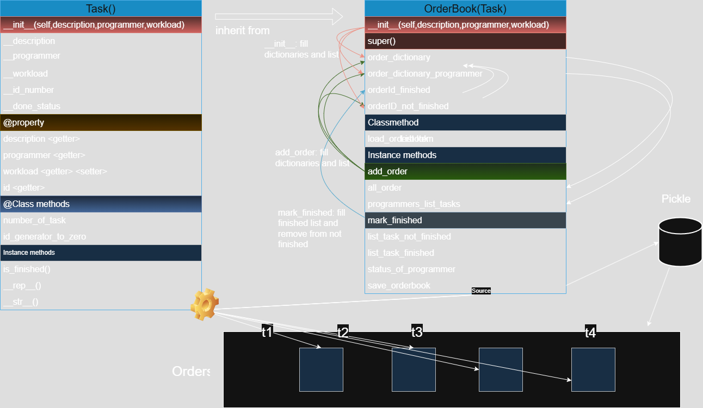

# Order book
Application that collects all tasks for a software company.

## Task Management System with CLI
This project provides a command-line interface (CLI) for managing software development tasks using object-oriented programming. 
The system allows tracking of programmer workloads, task statuses, and persistence via serialization. 
Built with Python, it consists of two core classes (Task and OrderBook) and a user-friendly menu-driven interface.

**Features**
1. Task Management
Create tasks with descriptions, assigned programmers, and workload estimates
- Unique auto-incrementing IDs for task tracking
- Mark tasks as finished/unfinished
- List tasks by completion status

2. Programmer Analytics
Track per-programmer statistics:
- Finished/unfinished tasks
- Hours worked vs. remaining workload
- View all programmers with active tasks

3. Data Persistence
- Save/load order books using Python's pickle
- Preserve task states between sessions

4. Input Validation
- Description length enforcement (<12 words)
- Workload type checking (integers/floats)
- Programmer name format validation

## System Architecture
### Core Classes
#### Task Class

```python
class Task():
    # Manages individual task properties and lifecycle
    def __init__(self, description, programmer, workload):
        # Input validation and initialization
```
Key Methods:
- mark_finished(): Updates task status
- is_finished(): Returns completion status
- workload property: Getter/setter with validation

#### OrderBook Class
```python
class OrderBook(Task):
    # Central hub for task management and analytics
    def __init__(self):
        # Initializes data structures for task storage
```
Key Methods:
- add_order(): Creates and stores new tasks
- status_of_programmer(): Provides programmer metrics
- save_orderbook()/load_orderbook(): Serialization methods



### Command-Line Interface (CLI)
Command Menu
```text
******* Main Commands ********
0 - Quit
1 - Add order
2 - List finished tasks
3 - List unfinished tasks
4 - Mark task as finished
5 - Show programmers
6 - View programmer status
7 - Save order book
8 - Load order book
```

Usage Examples

1. Adding a Task
```bash
command: 1
description: Fix login bug  
programmer and workload estimate: Alice 3.5
```
→ "added!"
2. Viewing Programmer Status

```bash
command: 6
programmer: Alice
→ "tasks: finished 2 not finished 1, hours: done 14 scheduled 5"
```
3. Persistent Storage

```bash
command: 7  # Saves to orderbook.pkl
command: 8  # Loads from orderbook.pkl
```
### Error Handling
The system includes robust validation for:
- Invalid command inputs
- Non-existent task IDs
- Malformed programmer names
- Incorrect workload formats
- File I/O errors during serialization
- Example error messages:

```bash
erroneous input: need a short (<12 words) description
erroneous input: workload must be a number
Error: No programmer named 'Bob' found
```

## Installation & Execution
Requirements
Python 3.8+
No external dependencies
Running the System

```bash
python main.py
```
File Management
Order books save to orderbook.pkl by default
Path shown after saving: /path/to/orderbook.pkl

## Development Goals
This project demonstrates:

OOP Principles: Inheritance, encapsulation, polymorphism

Data Structures: Efficient use of dictionaries and lists

CLI Design: User-friendly interface patterns

Persistence: Object serialization with pickle

Testing: Input validation and edge case handling

## Efficient Indexing Strategy

This system uses optimized data structures to ensure fast task retrieval and status checks while avoiding full-dataset scans. It is designed for high performance in managing and querying tasks.

### Core Components

1. **ID Dictionary (`order_dictionary`)**
`{task_id: Task}`
    - Provides direct O(1) access to any task by its unique ID.
2. **Programmer Index (`order_dictionary_programmer`)**
`{programmer: [tasks, stats]}`
    - Precomputes programmer-specific metrics such as:
        - Finished tasks
        - Pending tasks
        - Hours worked
        - Hours remaining
    - Enables O(1) access to workload analytics.
3. **Status Lists**
    - `finished_ids`: Stores only IDs of completed tasks.
    - `pending_ids`: Stores only IDs of incomplete tasks.

---

### Performance Benefits

| Operation | Time Complexity | Traditional Approach* |
| :-- | :-- | :-- |
| Get task by ID | O(1) | O(n) |
| List finished tasks | O(k) | O(n) |
| Programmer workload | O(1) | O(n) |
| Mark task finished | O(1)** | O(n) |

*Where *n* = total tasks, *k* = finished tasks
** Excludes list removal (O(m) where *m* = pending tasks)

---

### Key Advantages

- **Fast Retrieval**: Avoids scanning all tasks for common operations by leveraging pre-segregated lists and dictionaries.
- **Precomputed Metrics**: Programmer-specific statistics (finished/pending tasks, workload hours) are updated incrementally without recalculation.
- **Efficient Task Filtering**: Separate lists for finished and pending tasks enable direct iteration over specific subsets.
- **Memory/Speed Balance**: Achieves high-speed queries while maintaining reasonable memory usage.

This indexing architecture is tailored for frequent operations like task lookups, programmer workload analysis, and status filtering, making it highly performant and scalable.

This system provides a foundation for agile task management while demonstrating core software engineering principles. 
The modular design allows for easy expansion to meet specific team requirements.


